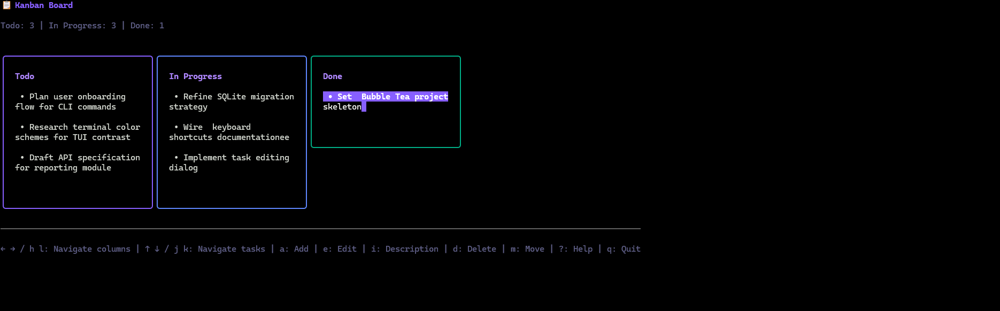

# cli_kanban



A terminal-based Kanban board management tool built with Go, featuring a beautiful TUI interface.

## Features

- 📋 **Three-column board**: Todo / In Progress / Done
- ✨ **Full CRUD operations**: Add, edit, and delete tasks
- 🏷️ **Task tags**: Categorize tasks with colored tags
- 📅 **Due dates**: Set deadlines with color-coded status (overdue, today, upcoming)
- 🔍 **Search & filter**: Quick search across tasks with tag: syntax support
- 🎨 **Beautiful TUI interface**: Built with Bubble Tea framework
- 💾 **SQLite persistence**: Data automatically saved to local database
- ⌨️ **Keyboard shortcuts**: Efficient keyboard navigation

## Installation

### Prerequisites

- Go 1.21 or higher
- GCC (for compiling SQLite)

### Build

```bash
# Clone or navigate to project directory
cd cli_kanban

# Download dependencies
go mod tidy

# Build
go build -o cli_kanban

# Run
./cli_kanban
```

## Usage

### Launch Application

```bash
# Use default database path (~/.cli_kanban.db)
./cli_kanban

# Specify custom database path
./cli_kanban --db /path/to/kanban.db
```

### Keyboard Shortcuts

#### Navigation
- `←` / `→` or `h` / `l` - Switch between columns
- `↑` / `↓` or `j` / `k` - Move between tasks

#### Actions
- `a` - Add new task to current column
- `e` or `Enter` - Edit selected task title
- `i` - Edit selected task description
- `t` - Edit selected task tags
- `u` - Edit selected task due date
- `d` or `Delete` - Delete selected task
- `m` - Move task to next column

#### Search
- `/` - Open search input
- `Enter` - Apply search filter
- `Esc` - Clear search filter (when active)

**Search syntax:**
- `keyword` - Search in title, description and tags
- `title:text` - Search only in title
- `desc:text` - Search only in description
- `tag:name` - Search only in tags (exact match)
- `due:YYYY-MM-DD` - Exact due date match
- `due:<YYYY-MM-DD` - Due before date
- `due:>YYYY-MM-DD` - Due after date
- `due:<=YYYY-MM-DD` - Due on or before date
- `due:>=YYYY-MM-DD` - Due on or after date

#### Other
- `F5` - Refresh board (reload tasks)
- `?` - Show help
- `q` or `Ctrl+C` - Quit application
- `Esc` - Cancel current action or quit

## Project Structure

```
cli_kanban/
├── main.go              # Entry point and Cobra commands
├── go.mod               # Go module dependencies
├── internal/
│   ├── db/
│   │   └── sqlite.go    # SQLite database operations
│   ├── model/
│   │   └── task.go      # Data model definitions
│   └── tui/
│       ├── model.go     # Bubble Tea model
│       ├── update.go    # Event handling logic
│       └── view.go      # View rendering
└── README.md
```

## Tech Stack

- **[Bubble Tea](https://github.com/charmbracelet/bubbletea)** - TUI framework
- **[Lipgloss](https://github.com/charmbracelet/lipgloss)** - Styling and layout
- **[Bubbles](https://github.com/charmbracelet/bubbles)** - TUI components
- **[Cobra](https://github.com/spf13/cobra)** - CLI framework
- **[SQLite](https://github.com/mattn/go-sqlite3)** - Data persistence

## Data Model

### Task

| Field | Type | Description |
|-------|------|-------------|
| id | INTEGER | Auto-increment primary key |
| title | TEXT | Task title |
| description | TEXT | Task description |
| status | TEXT | Task status (todo/in_progress/done) |
| tags | TEXT | Comma-separated tags |
| due | DATETIME | Due date (optional) |
| created_at | DATETIME | Creation timestamp |
| updated_at | DATETIME | Last update timestamp |

## Development

```bash
# Run (development mode)
go run main.go

# Format code
go fmt ./...

# Run tests
go test ./...
```

## License

MIT
